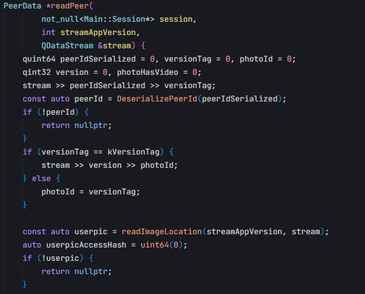

# TdataDecrypt

根据tdesktop_decrypter修改而来，增加了对客户端部分配置的解析，获取代理配置主要是对telegram 聊天记录爬虫的补充。由于爬虫是使用tdata的Session，同时在线会产生问题。于是想通过解析本地配置，来判断目标tdata是否在线，找了一些lastseen等参数，但是发现都不够精确。

怎么解析一个tdata呢？当然网上有很多方法，但是不一定有我们需要的内容。我们自己解析时，其实主要就用户名、手机号这些，这部分内容是在telegram的desktop源码中，桌面端是开源的，完全可以自己看代码来解析，源码解析tdata文件中存储的账号，主要是在 storage/storage_account.cpp

直接看storage_account.cpp里面的readPeer就知道这些字段是什么意思了，以及该怎么反序列化stream流来解出自己需要的信息

## 简单说明

这个项目目前主要做两件事：

- 解析账号基础信息：`userid`、`username`、`name`、`phone`
- 解析客户端代理配置

入口文件是 `main.py`。

## 代码怎么读

如果只是想快速看懂项目，按这个顺序读就够了：

1. `main.py`
2. `decrypter.py`
3. `storage.py`
4. `crypto.py`
5. `settings.py`
6. `qt.py`
7. `tdf.py`

## 每个文件大概是干什么的

- `main.py`：程序入口，接收参数并输出结果
- `decrypter.py`：主逻辑，负责串起整个解析流程
- `storage.py`：解密 `settings`、`key_data`、`maps`
- `crypto.py`：密钥派生和 AES 解密
- `settings.py`：解析 Telegram Desktop 的设置块
- `qt.py`：读取 Qt 序列化的基础类型
- `tdf.py`：解析 TDF 文件格式
- `file_io.py`：读文件并调用解密

## 如果你要自己继续解字段，先看哪里

### 1. 想看程序主流程

先看 `decrypter.py` 里的这几个地方：

- `TdataReader.read`
- `TdataReader.read_key_data`
- `TdataReader.read_settings`

### 2. 想解账号信息

重点看：

- `AccountReader.read_mtp_data1`
- `AccountReader.read_maps_data`

其中 `read_maps_data` 是当前提取 `name`、`phone`、`username` 的关键位置。

### 3. 想解代理配置

重点看：

- `TdataReader.read_settings`
- `read_setting_authorization`
- `settings.py` 里的 `SettingsBlocks`

### 4. 想研究底层解密

重点看：

- `storage.py`
- `crypto.py`
- `tdf.py`
- `qt.py`

## 一句话理解这个项目

先从 `settings` 和 `key_data` 里拿到解密所需信息，再去解账号文件和 `maps`，最后提取出账号信息和代理配置。
